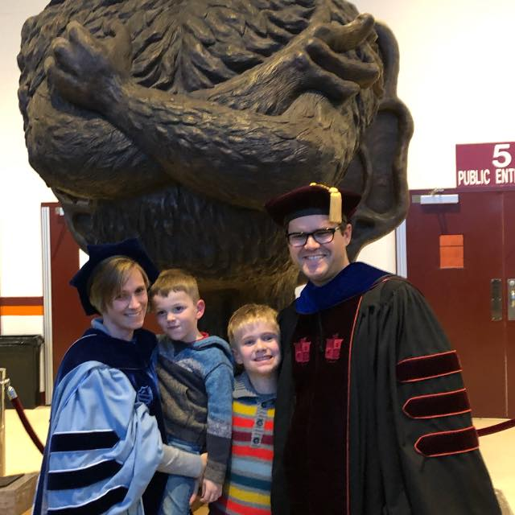
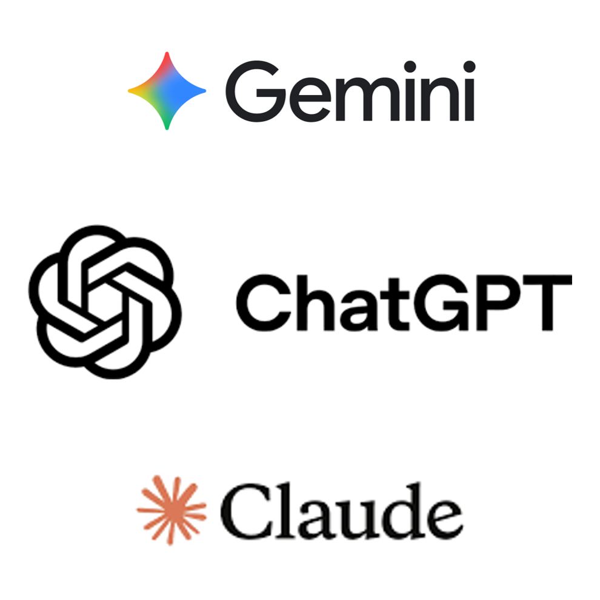
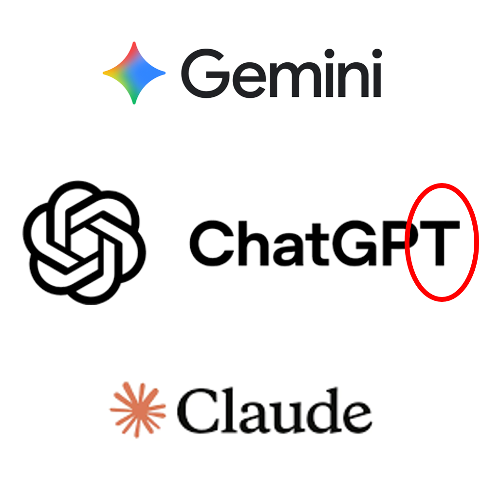
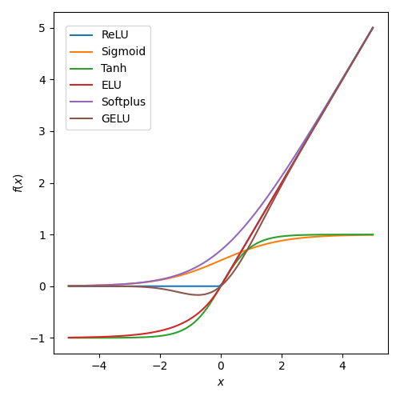
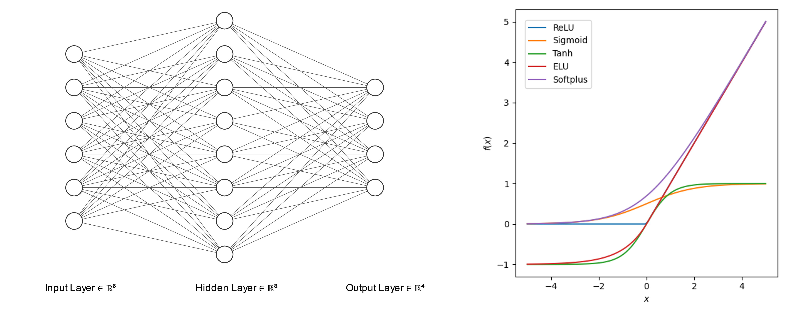
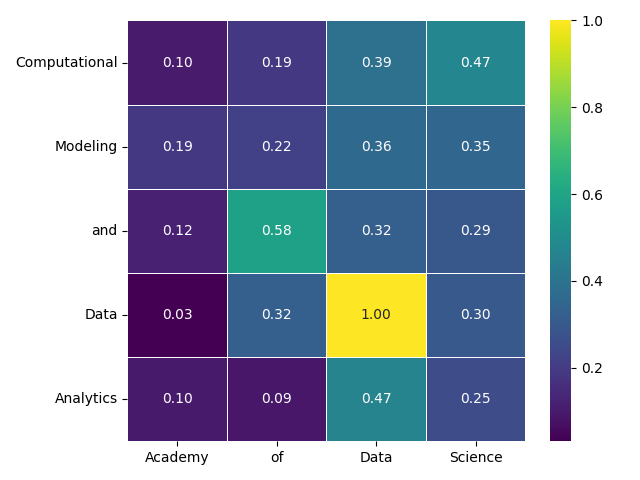
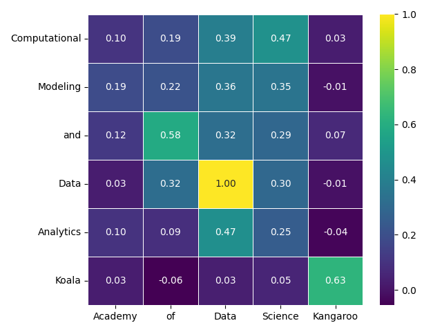
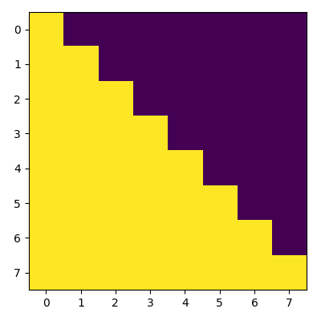
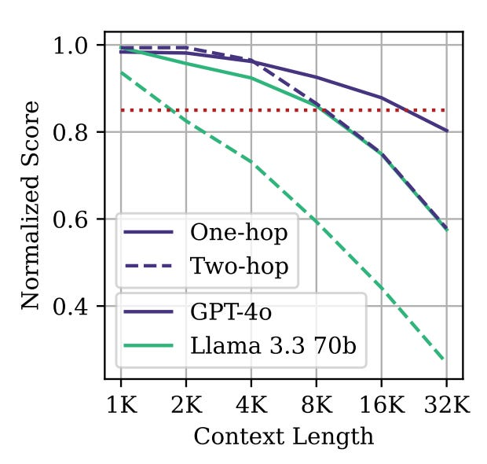
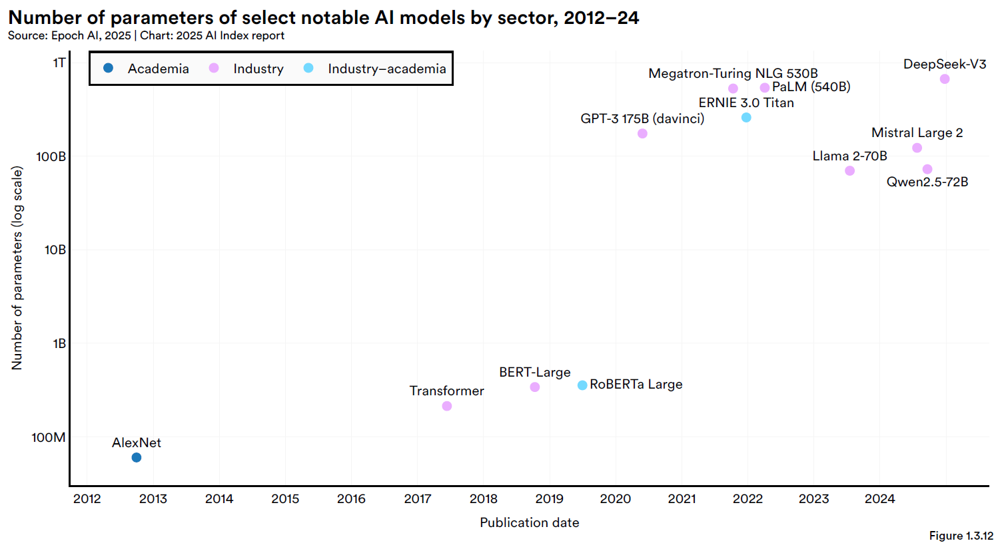

## Before we start

Repository with slides and (Python) code: https://github.com/krometis/transformers

Consider running setup commands now - package downloads and installation can take time

---


# An Introduction to Transformers

Justin Krometis | Virginia Tech

January 28, 2026

---



## About Me

- Hokie x 3 (Ph.D., Math, 2018)
- Research Associate Professor with VT National Security Institute
- Previously:
    - Computational Scientist with Advanced Research Computing
    - Senior Transportation Analyst with IEM, Inc.

---


## Why Transformers?

- Introduced by Google researchers in 2017
- State of the art in natural language processing
- The advance that enabled the modern AI explosion

---


## Why Transformers?

- Introduced by Google researchers in 2017
- State of the art in natural language processing
- The advance that enabled the modern AI explosion
    - GPT: Generative Pre-trained **Transformer**

---


## What is a Transformer?

- Model for understanding and generating sequential data
- Developed for natural language processing, e.g., text translation
    - Use has grown since (vision, audio)
- Key innovation: **Attention**

<small><i>Reference: Vaswani, et al. "Attention Is All You Need." 2017. https://arxiv.org/abs/1706.03762.</i></small>

---

# Background

---

## Linear Models

Given:
- Inputs $\mathbf{x} \in \mathbb{R}^{n}$
- A matrix (weights) $W \in \mathbb{R}^{m \times n}$ 
- Intercepts (biases) $\mathbf{b} \in \mathbb{R}^{m}$

We compute output $\mathbf{y} \in \mathbb{R}^{m}$:
$$\mathbf{y} = W \mathbf{x} + \mathbf{b}$$

---

<!---->
## A Simple Nonlinear Model

As before, we compute:
$$\mathbf{z} = W \mathbf{x} + \mathbf{b}$$

But now we pass the result through a nonlinear function $f: \mathbb{R}^{m}\to \mathbb{R}^{m}$:
$$\mathbf{y} = f(\mathbf{z})$$

---

<!---->
## Feedforward Neural Networks


---

# Transformers

---


## What is a Transformer?

Key components:
- Embedding: Represent inputs and outputs
- Attention: Identify relationships that matter
- Feedforward: Turn inputs into outputs

Simplification:
- Focus on GPT models
- Same input/output space (no encoder)
---

## Embedding

- Machine learning models work through math
- But operate in non-mathematical applications (text, audio, images)
- How do we translate non-numeric inputs and outputs into numbers?

Answer: Embeddings

(_Note_: Feature selection or extraction is a key consideration beyond NLP or transformers)

---

## Embedding (Continued)

- Map inputs into _tokens_
- Map tokens into (high-dimensional) vectors of numbers
- Vectors that are close together should conceptually similar
- Tokens that are different or unrelated should be far apart

Key metric: Cosine similarity:
$$S_c(\mathbf{v}_1,\mathbf{v}_2) = \frac{\mathbf{v}_1 \cdot \mathbf{v}_2}{\| \mathbf{v}_1 \| \| \mathbf{v}_2 \| }$$

---

## Embedding - Example (continued)

```python
import numpy as np
import spacy

def cosine_similarity(v1,v2):
    return np.dot(v1,v2) / ( np.linalg.norm(v1) * np.linalg.norm(v2) )

nlp = spacy.load("en_core_web_lg")
doc1 = nlp("Computational Modeling and Data Analytics")
doc2 = nlp("Academy of Data Science")

cos_sim = np.zeros((len(doc1),len(doc2)))
for i,token1 in enumerate(doc1):
    for j,token2 in enumerate(doc2):
        cos_sim[i,j] = cosine_similarity(token1.vector,token2.vector)
```

---

## Example Similarities
<style scoped>
p { text-align: center; }
</style>


---

## Example Similarities ( :koala: :kangaroo: )
<style scoped>
p { text-align: center; }
</style>


---

## Why Attention?

Imagine completing the sentence:

> The Virginia Polytechnic Institute and State University, commonly referred to as Virginia Tech (VT), is a public land-grant research university...
>
> _[several paragraphs of text]_
>
> Under the leadership of seventh president ...

Traditional (pre-transformer) models for text prediction would struggle to connect "president" with "Virginia Tech".

Need: Model that can communicate information across long distances in the sequence

---

## Quick Aside: Masking

A partial sentence with eight words:
> The Academy of Data Science teaches students to...

Actually presents eight training opportunities:
- The ...
- The Academy ...
- ...
- The Academy of Data Science teaches students ...
- The Academy of Data Science teaches students to ...

---


## Masking, Continued

Goal:
- Leverage all sequences for efficiency

Requirement:
- Predictions should only be influenced by preceding words

Implementation:
- Add a lower-triangular "mask" to the connections between words

---

## Attention
Three key concepts:
- Query: What information do I need?
- Key: What information do I contain?
- Value: What will I add if you find me interesting?

All three are linear maps from the embedding $X \in \mathbb{R}^{d_{\text{embed}}\times d_{\text{context}}}$:
$$Q = W_q X, \quad K = W_k X, \quad V = W_v X$$

_Note_: $W_q, W_k \in \mathbb{R}^{d_k \times d_{\text{embed}}}$ and $W_v \in \mathbb{R}^{d_v \times d_{\text{embed}}}$ all learned in training

---

## Masked Dot-product Attention

$$ A(Q,K,V) = \text{Softmax}\left( M\left( \frac{1}{\sqrt{d_k}} Q K^T \right) \right) V $$

Step-by-step:
* $Q K^T$ finds the queries and keys that best match
* Divide by $\sqrt{d_k}$ to mitigate scaling effects
* $M(\cdot)$ applies the mask
* $\text{Softmax}(\cdot)$ converts to weights (formula: $e^{x_i}/\sum_j e^{x_j}$)
* Multiply by $V$ to get weighted values

---

## Example Implementation (PyTorch)

```python
import torch, torch.nn as nn, torch.nn.functional as F

def attention(q,k,v):
    mask    = torch.tril( torch.ones(q.shape[-2],q.shape[-2]) ).bool()
    qkT     = torch.matmul( q, k.transpose(-2,-1) ) / (q.shape[-1]**0.5)
    qkT_msk = qkT.masked_fill_(~mask, value=float("-inf"))
    weights = F.softmax(qkT_msk,-1)
    att     = torch.matmul(weights,v)
    return att
```

---

## Example Implementation (PyTorch Class, 1)

```python
import torch, torch.nn as nn, torch.nn.functional as F

class SelfAttentionHead(nn.Module):

    def __init__(self, d_embed, d_cntxt, d_k, d_v):
        super().__init__()
        
        self.d_k   = d_k
        #trainable maps
        self.query = nn.Linear(d_embed,d_k,bias=False)
        self.key   = nn.Linear(d_embed,d_k,bias=False)
        self.value = nn.Linear(d_embed,d_v,bias=False)
        #not trainable mask
        self.register_buffer('mask', torch.tril( torch.ones(d_cntxt,d_cntxt) ).bool())
```        

---

## Example Implementation (PyTorch Class, 2)

```python
    def attention(self,q,k,v):
        qkT     = torch.matmul( q, k.transpose(-2,-1) )
        qkT_scl = qkT / torch.sqrt(torch.tensor(self.d_k))
        qkT_msk = qkT_scl.masked_fill_(~self.mask, value=float("-inf"))
        weights = F.softmax(qkT_msk,-1)
        att     = torch.matmul(weights,v)
        return att

    def forward(self,x):
        q = query(x)
        k = key(x)
        v = value(x)
        
        return self.attention(q,k,v)
```

---


## Notes

- Capture longer-distance connections
    - Up to the context window length $d_{\text{context}}$
- More scalable/parallelizable
    - No recurrence or convolutions
- Attention scales like square of context window $d_{\text{context}}^2$
    - "Context rot"<!--: Deterioration on tasks as context window scales-->

<i>Ref: Modarressi, et al. "NoLiMa: Long-Context Evaluation Beyond Literal Matching." 2025. https://arxiv.org/abs/2502.05167.</i>

---


## Completing the Transformer

1. Multi-head attention: Multiple blocks in parallel & concatenate
2. Linear layer to re-inflate to embedding dimension
3. Feedforward layer
4. Iterate several attention blocks (deeper network)
5. Positional encoding
6. Training practicalities
    - "Skip" (residual) connections to retain information deeper in network
    - Layer normalization to mitigate gradients
    - Dropout to reduce overfitting

---

## Multi-head Attention

```python
class MultiHeadAttentionLayer(nn.Module):
    '''Defines a layer of multihead attention'''
    def __init__(self, n_head, d_embed, d_cntxt, d_k, d_v):
        super().__init__()
        
        #list of attention heads to be run side by side
        self.attnHeads = [ SelfAttentionHead(d_embed,d_cntxt,d_k,d_v) for _ in range(n_head) ]
        #projection back to the embedding dimension
        self.toEmbed   = nn.Linear(d_v*n_head,d_embed)
        
    def forward(self,x):
        #run all heads and concatenate
        out = torch.cat([ head(x) for head in self.attnHeads],-1)
        #run the linear layer to project back to the embedding dimension
        out = self.toEmbed(out)
        return out
```

---

## Transformer Block

```python
class TransformerBlock(nn.Module):
    '''Defines a block of a transformer model'''
    def __init__(self, n_head, d_embed, d_cntxt, d_k, d_v):
        super().__init__()
        
        #multi-head attention layer
        self.multiHead = MultiHeadAttentionLayer(n_head,d_embed,d_cntxt,d_k,d_v)
        #feedforward layer
        self.ffw = nn.Sequential(
            nn.Linear(d_embed,d_embed*4),
            nn.ReLU(),
            nn.Linear(d_embed*4,d_embed),
        )
        #layer normalizations
        self.norm1 = nn.LayerNorm(d_embed)
        self.norm2 = nn.LayerNorm(d_embed)
        
    def forward(self,x):
        #run multi-head attention w/ residual connection & layer norm
        x = self.norm1( x + self.multiHead(x) )
        #run feedforward layer w/ residual connection & layer norm
        x = self.norm2( x + self.ffw(x) )
        return x
```

---

## Transformer: Initialization

```python
class TransformerModel(nn.Module):
    '''
    Defines a transformer model
    '''
    def __init__(self, n_layer, n_head, d_vocab, d_embed, d_cntxt, d_k, d_v, pe_orig=True):
        super().__init__()
        
        #blocks (each multi-head attention + feedforward)
        self.blocks  = nn.Sequential(*[ 
            TransformerBlock(n_head,d_embed,d_cntxt,d_k,d_v) 
            for _ in range(n_layer) 
        ])
        
        #linear layer to return to vocab size
        self.toVocab = nn.Linear(d_embed,d_vocab)
        
        #not trainable mask
        self.register_buffer('p_embed', self.pos_embed(d_cntxt,d_embed,original=pe_orig) )
```

---

## Transformer: Position Embedding

```python
    def pos_embed(self,d_cntxt,d_embed,original=True):
        p_embed = torch.zeros(d_cntxt,d_embed)
        if original:
            #PE(pos,2i  ) = sin((pos/10000)^(2i/d_embed))
            #PE(pos,2i+1) = cos((pos/10000)^(2i/d_embed))
            den = torch.pow(10000,-torch.arange(0,d_embed,2)/d_embed)
        else:
            #regular fourier basis seems more sane?
            den = 2*torch.pi*torch.arange(0,d_embed,2)/d_embed
        pos = torch.arange(d_cntxt)
        ang = torch.outer(pos,den)
        p_embed[:, ::2] = torch.sin(ang)
        p_embed[:,1::2] = torch.cos(ang)
        return p_embed
```

---

## Transformer: Forward & Prediction

```python
    def forward(self,x):
        #add positional embedding
        x = x + self.p_embed
        #run blocks
        attn_out = self.blocks(x)
        #run linear layer
        logits = self.toVocab(attn_out)
        #convert to probabilities
        probs  = F.softmax(logits,-1)
        return probs #for training should add loss here
    
    def predict(self,x):
        #get probabilities associated with last entry in context
        probs = self(x)[:,-1,:]
        #draw to get a prediction (probabilistic!)
        idx = torch.multinomial(probs, num_samples=1)
        return idx
```

---

# Conclusions

---

## Summary

- Transformer: New (<10 years) model underlying much of the AI boom
    - GPT: Generative Pretrained Transformer
- Attention: A mechanism for connecting sequential data
    - Allows connections across long distances
    - Highly parallel

---

## Onward



<it>Ref: Maslej, et al. “The AI Index 2025
Annual Report,” Stanford University. April 2025.
https://arxiv.org/abs/2504.07139.</it>

---


## Hands On

- Implementation: Run or tinker with the code shown earlier :keyboard:
- Embeddings: Explore embeddings and cosine similarity :bar_chart:
- Transformers: Visualize attention in 3rd party models :brain:
- Activations: Plot activation functions :yawning_face:

Repository: https://github.com/krometis/transformers